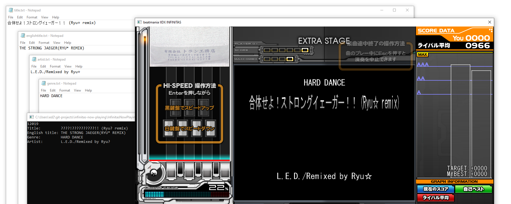

# DISCONTINUED - use Reflux instead

Stop using this app and use [Reflux](https://github.com/olji/Reflux) instead. It's much better and has a load more options. Go and give them a Star!

# Infinitas Now Playing

This quick and dirty app reads the memory of Beatmania IIDX Infinitas and writes the currently playing song title (and English / 16Seg title), genre and artist to four text files, ready to be read by streaming apps.

Built for app version P2D:J:B:A:2021020300. This will very likely break on updates.

Runs on .NET Framework 4.6 so should just work on any version of Windows 10 without any extra faffing.



## How to use

- Run ```InfinitasNowPlayingReader.exe``` as Admin (needed to read the memory of other programs)
- Start Infinitas

Once you get to the song selection screen, the app will start writing the following text files alongside the exe when a different song is highlighted on the song selection screen:

- ```title.txt``` : The song title
- ```englishtitle.txt``` : The english song title (used for the 16seg display)
- ```genre.txt``` : the song genre
- ```artist.txt``` : the song artist

Detection is when playing a song preview, so Random song selection does not work (as it doesn't play a preview). The files won't then change during the song.
